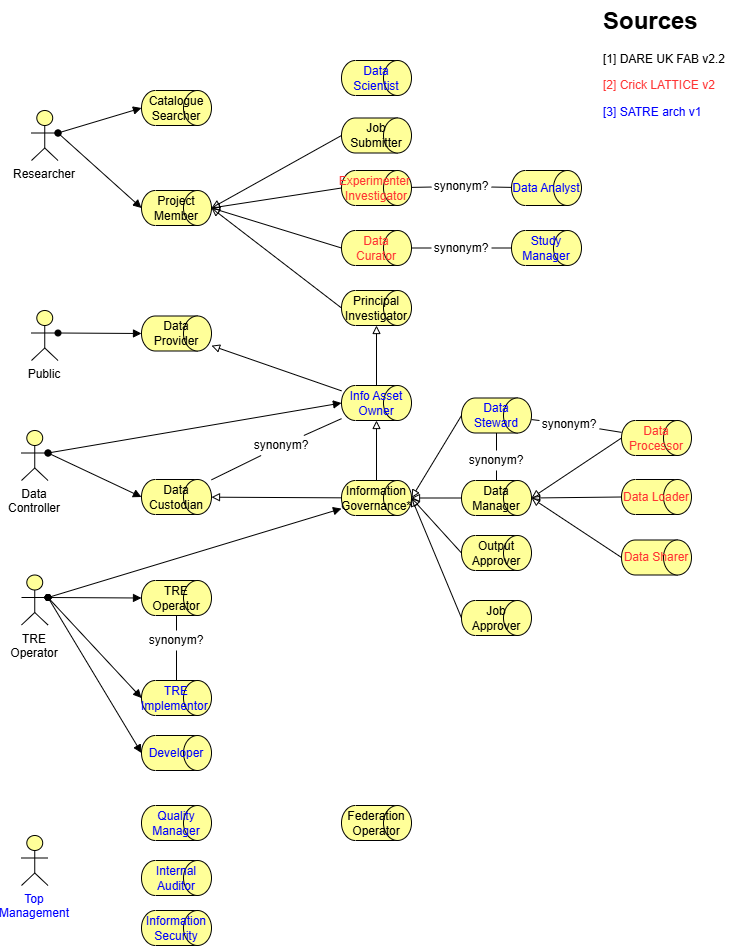

# TRE Actors and Roles

Drawing from a number of sources we can create a consolidated list of system actors and roles they 
can take in working with TREs. Different [TRE archetypes]() can have different relationships between
these roles, but the roles themselves are consistent across all archetypes.

As an example, a Data Manager role may be taken by an Information Governance actor, or in other archetypes
may be delegated or otherwise assigned to a Project Principal Investigator.

## Sources

We draw from the following sources:

 1.  [DARE UK Federated Architecture Blueprint v2.2](https://zenodo.org/records/14192786), especially section 4.2.
 2.  [Francis Crick Institute LATTICE](https://doi.org/10.25418/crick.28759961.v2), chapter 3.
 3.  [UCL/SATRE Standard Architecture for TREs](https://zenodo.org/records/10053383), the architectural model behind the SATRE specification v1.0.

## Identified actors and roles

###

###

## Mapping of actors and roles

