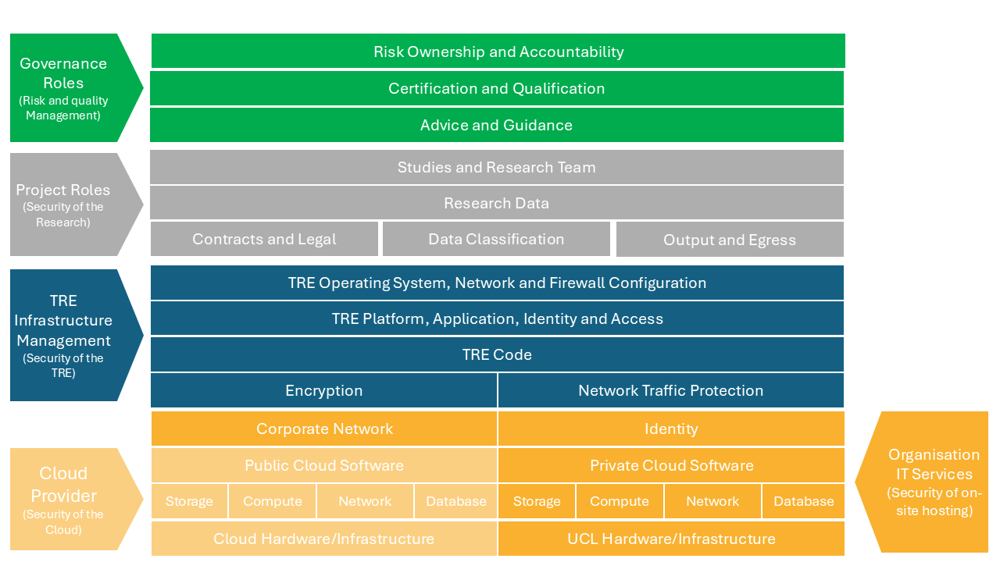

# TRE Archetypes

## 1. TRE Zones
When describing the characteristics TRE archetypes it is useful to use the concept of zones. This concept is detailed in the [DARE UK Federated Architecture Blueprint](https://github.com/DAREUK/tre-federation/tree/main) described as follows:

### 1.1. Zones Described in the DARE Federated Architecture

*"zones require different levels of governance and approval for the roles accessing them, and in particular, movement of data between them should be subject to appropriate controls and potential “air-gapping” to manage the related disclosure risks."*

#### Research Analytics Zone (RAZ)
*This zone provides the means for a Project Member to gain direct access to the data their project is approved to use, in an environment suitable for the analyses their research requires. This is often realised as a virtual desktop environment, a computational notebook or similar. There is often a strict requirement that project environments be completely isolated from one another.*

*NB: A TRE need not have an RAZ. Instead it may operate as a pure data provider (with just a Secure Data Zone), or as a “headless” TRE able to run queries against data it hosts (with both a Secure Data Zone and a Query Management Zone).*

#### Secure Data Zone (SDZ)
*This zone supports the ingress, egress, management, linkage, curation and provision of research-ready sensitive datasets. TRE Governance actors with roles Data Manager and Output Approver SHALL be granted access to the SDZ; all other roles SHALL NOT be granted access.*

*NB: A TRE need not have an SDZ. Instead it may operate as a pure analytics environment, with an RAZ supporting Project Environments with purely Remote data views, or with access solely to a Job Submission layer.*

#### Query Management Zone (QMZ)
*This zone handles queries sent to the TRE from other, remote TREs or external Job Submission services. Typically it sits alongside an SDZ and provides different methods of access to approved research-ready datasets stored within the SDZ.*

*NB: A TRE need not have a QMZ. Instead it may operate as a “classic” TRE, with an RAZ supporting Project Environments and an SDZ supporting data hosting, ingress and linkage, or as a pure analytics environment, with an RAZ supporting Project Environments with purely Remote data views.*

**Baxter, R. (2024)** Chapter 4 Federated architecture: infrastructure layer. Available at: https://github.com/DAREUK/tre-federation/blob/main/architecture/4_Infrastructure_Layer/4_3_1_TRE.md (Accessed: 02/06/2025).

### 1.2. Additional Zones

In addition to the zones above taken from the [DARE Federated Architecture](https://github.com/DAREUK/tre-federation/blob/main/architecture/4_Infrastructure_Layer/4_3_1_TRE.md) we propose 2 additional zones:

#### Orchestration Zone (OZ)
This zone manages the deployment and maintenance of infrastructure and the configuration of the TRE. This zone contains no research data and Shall not be accessible to any researcher/project role. [Infrastructure management roles](https://satre-specification.readthedocs.io/en/stable/roles.html#infrastructure-management-roles) own and operate within this zone.

 In the case of a "Infrastructure as Code" TRE some proportion of this zone may sit in an external platform used to manage a Git repository.

 NB; A TRE need not have an OZ where the deployment and configuration of the TRE is managed through other means.

 #### Demilitarized Zone (DMZ)

A demilitarized zone is a perimeter network that protects and adds an extra layer of security to the TREs internal network from untrusted traffic. The DMZ would contain "Security Server" described in the [DARE Federated Architecture](https://github.com/DAREUK/tre-federation/blob/main/architecture/4_Infrastructure_Layer/4_3_1_TRE.md).

NB; A TRE need not have a DMZ. While this is rare, physically air gapped systems are used in justice and national security settings and usually consist of isolated systems in physically controlled safe rooms.

## 2. Archetypes

There are two TRE archetypes in use across the community of providers in the UK. 

### 2.1. Data Provider Archetype

The first is most commonly operated by a single data provider, providing the data and the environment for researchers to use for analysis. Examples of such TREs include the NHS SDEs, ONS secure research service and the UKDS SecureLab. Such TREs generally provide a curated data set to researchers and a secure environment to work within. These TRE providers have greater responsibility for ensuring all 5 of the 5 Safes including Safe Data (e.g. de-identification of source data sets and curated extracts) and Safe Outputs (e.g. providing output checking service).

The TRE operator is responsible for management of data and access to curated data sets for researchers. Curated data may be extracted and copied or access provided through other means. Safe Outputs from the environment remain under the control of the TRE operator.

#### Data provider archetype shared responsibility model

### 2.2. Bring Your Own Data Archetype

The second archetype is commonly used in Universities and operates under a “bring your own data” model. Researchers acquire data from a 3rd party or generate data through their research (or both) and use the TRE to store, manage and process those data. Such TREs provide segregated secure storage (a data management zone) for each project to support medium-long term storage and retention of the source data. 

In such TREs the TRE provider (often research IT within the university) is only responsible for the safe setting. The wider organization is responsible for the other 4 safes with these usually delegated in part to the research teams themselves. Examples of such TREs are UCL ARC TRE, Turing Data Safe Haven and Kings College’s CREATE platform.

The project boundary spans both the secure data and research analytics zones. An information asset owner is accountable for the management of the source data and any extracts. Safe Outputs from the environment may also be under the control of the asset administrator or their delegate.

#### Bring your own data shared responsibility model

